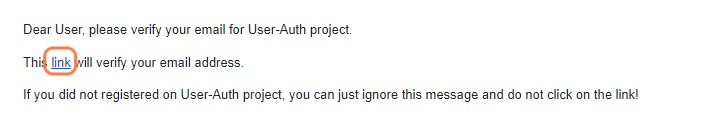
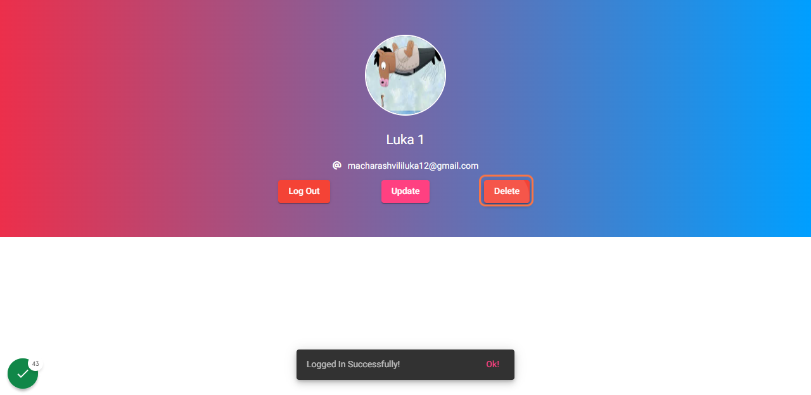

# Trello

User Authentication With Mean Stack, JWT and Passport.js.

# Application Guide

**1.** Go to My [User Authentication](https://user-auth-b4438.web.app/) Website
 Enter register information and click Register. Email Verification will be sent to your email.

**2.** Enter register information and click Register. Email Verification will be sent to your email.

 
**3.** Click on the link to verify
 

 
**4.** Enter Login information and click "Log In" button. You will be redirected to profile page
page.

 
**5.** Click on Log Out

 
**6.** Click on Forgot Password and enter email that you are registered with. Click send. Password reset link will be sent on your email

 
**7.** Click on the link. you will be redirected to password reset page.

 
**8.** Enter new password and click save.

 
**9.** Log in with new password

 
**10.** Click on Update

 
**11.** Enter new info and click Save

 
**12.** Click on Delete

 
**13.** Click on I understand the consequences, delete this User!

 
